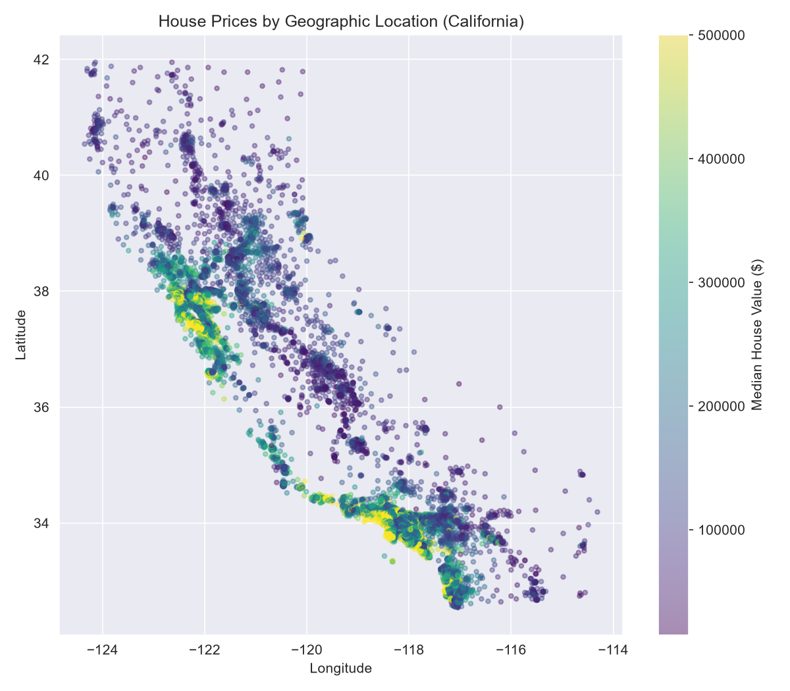

# 🏠 House Price Prediction — Deployed ML App

An end-to-end machine learning project predicting California house prices, from raw data to a live deployed web app. Trained on 20,640 real housing records with a production-grade pipeline and XGBoost.

## 🌐 Live Demo
[Try the live app](https://housepriceapppy-5bnwirjsaeebajyv3gjd7b.streamlit.app/)

## 📌 Overview
This project goes beyond a typical training notebook — it includes proper preprocessing pipelines, model comparison, and a deployed Streamlit app where anyone can input house details and get a real-time price prediction.

## 🛠️ Tools & Libraries
- Python
- Pandas, NumPy
- Scikit-learn (Pipeline, ColumnTransformer)
- XGBoost
- Streamlit (deployment)
- Joblib (model persistence)

## 🔍 Steps Followed
1. **Data Loading** — 20,640 real California housing records (1990 census data).
2. **EDA** — Price distribution, correlation heatmap, and a geographic price map.
3. **Feature Engineering** — Created `rooms_per_household`, `bedrooms_per_room`, `population_per_household`; applied log transformation to the target price.
4. **Preprocessing Pipeline** — Built a `ColumnTransformer` handling missing values, scaling, and one-hot encoding for categorical features — all inside a single reusable `Pipeline`.
5. **Model Building** — Trained and compared Linear Regression, Ridge Regression, Random Forest, and XGBoost.
6. **Evaluation** — Compared RMSE, MAE, MAPE, and R², validated with 5-fold cross-validation.
7. **Deployment** — Saved the full pipeline with `joblib` and built a Streamlit app for live predictions.

## 📊 Model Results

| Model               | RMSE     | MAE      | MAPE   | R² Score |
|----------------------|----------|----------|--------|----------|
| Linear Regression     | $90,690  | $52,060  | 26.26% | 0.3724   |
| Ridge Regression       | $90,693  | $52,069  | 26.26% | 0.3723   |
| Random Forest          | $50,559  | $31,657  | 16.64% | 0.8049   |
| **XGBoost (Best)**     | $47,178  | $30,011  | 15.83% | **0.8301** |

**5-Fold CV Mean R²:** 0.7058 (±0.0562) — a more conservative, honest generalization estimate.

**Key finding:** `median_income` is the strongest predictor, followed by location (longitude/latitude).

## 📁 Files
- `house_price_prediction_v2.py` — full training pipeline (commented)
- `house_price_app.py` — Streamlit deployment app
- `house_price_model.pkl` — trained pipeline (generate this yourself by running `train_model.py` — see below)
- `requirements.txt` — dependencies
- `housing.csv` — dataset
- `*.png` — EDA and evaluation visualizations

## 🚀 How to Run Locally
```bash
pip install -r requirements.txt
python train_model.py          # trains the model, saves house_price_model.pkl
python -m streamlit run house_price_app.py
```

## 📈 Sample Visualization

